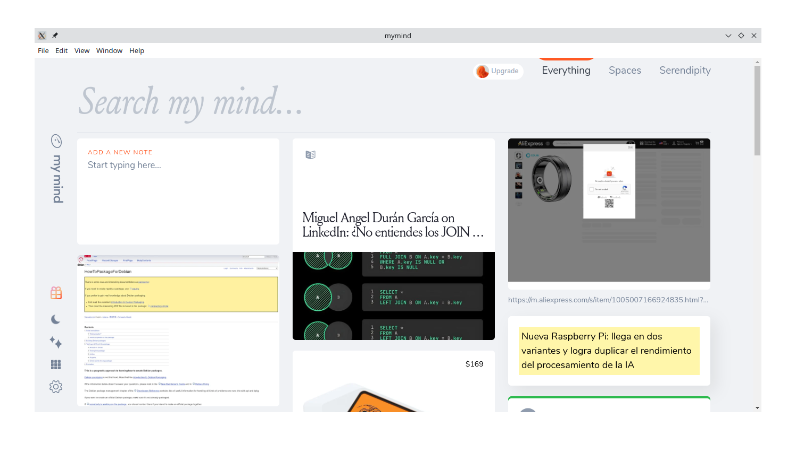

# MyMind Electron App
Esta es una adaptación con Electron de la aplicación web MyMind para usarla en versión de escritorio. La aplicación permite gestionar tus notas y pensamientos de manera eficiente y accesible desde tu escritorio.

## Capturas de la Aplicación


## Características
- Acceso rápido a MyMind desde el escritorio.
- Funcionalidad completa de la aplicación web en una aplicación independiente.
- Soporte multiplataforma: Windows, macOS y Linux.

## Instalación
### Requisitos
- Node.js y npm instalados en tu sistema.
- [Electron](https://www.electronjs.org/) instalado globalmente.


### Pasos
1. Clona este repositorio:
   ```bash
   git clone https://github.com/AndreaKinder/mymind-electron-app.git
   cd mymind-electron-app
   ```

2. Instala las dependencias:
   ```bash
   npm install
   ```

3. Ejecuta la aplicación:
   ```bash
   npm start
   ```

## Construir la Aplicación
Para construir la aplicación y obtener los ejecutables para tu sistema operativo:
```bash
npm run build
```
Los archivos construidos se colocarán en el directorio `dist`.

### Contenido del directorio `assets/icons`
* `win-icon.ico`: Icono para la aplicación en Windows.
* `mac-icon.icns`: Icono para la aplicación en macOS.
* `mymind-ico.ico`: Icono para la aplicación en Linux.


## Contribuir
¡Gracias por considerar contribuir a MyMind Electron App! Si deseas reportar un error o sugerir una nueva característica, por favor crea un issue en este repositorio.
   
